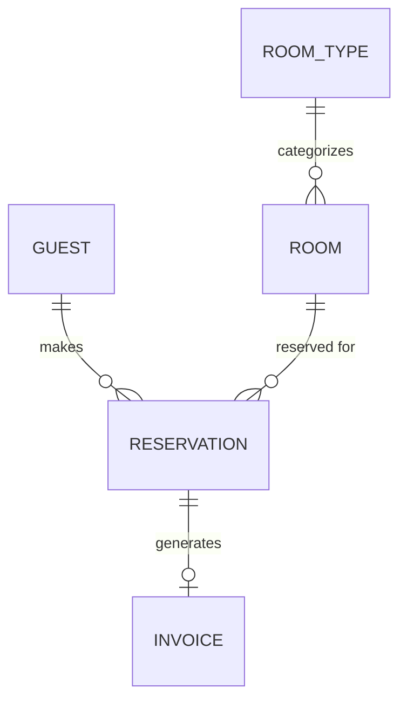

# Entity Model

## Entity Relationship Diagram

### GUEST

A person who books or stays at the hotel.

| Attribute  | Description        | Data Type | Length/Precision | Validation Rules                |
|------------|--------------------|-----------|------------------|---------------------------------|
| id         | Unique identifier  | Long      | 19               | Primary Key, Sequence           |
| first_name | Guest's first name | String    | 50               | Not Null                        |
| last_name  | Guest's last name  | String    | 50               | Not Null                        |
| email      | Email address      | String    | 100              | Not Null, Unique, Format: Email |
| phone      | Phone number       | String    | 20               | Optional                        |

### ROOM_TYPE

Defines categories of rooms with shared characteristics and pricing.

| Attribute       | Description              | Data Type | Length/Precision | Validation Rules          |
|-----------------|--------------------------|-----------|------------------|---------------------------|
| id              | Unique identifier        | Long      | 19               | Primary Key, Sequence     |
| name            | Name of the room type    | String    | 50               | Not Null, Unique          |
| description     | Detailed description     | String    | 500              | Optional                  |
| capacity        | Maximum number of guests | Integer   | 10               | Not Null, Min: 1, Max: 10 |
| price_per_night | Price per night in CHF   | Decimal   | 10,2             | Not Null, Min: 0          |

### ROOM

A physical room in the hotel assigned to a room type.

| Attribute    | Description                     | Data Type | Length/Precision | Validation Rules                                             |
|--------------|---------------------------------|-----------|------------------|--------------------------------------------------------------|
| id           | Unique identifier               | Long      | 19               | Primary Key, Sequence                                        |
| room_number  | Displayed room number           | String    | 10               | Not Null, Unique                                             |
| room_type_id | Reference to room type          | Long      | 19               | Not Null, Foreign Key (ROOM_TYPE.id)                         |
| status       | Current status of the room      | String    | 20               | Not Null, Values: available, occupied, cleaning, maintenance |
| floor        | Floor where the room is located | Integer   | 10               | Optional                                                     |

### RESERVATION

A booking of a room by a guest for a specific period.

| Attribute      | Description                 | Data Type | Length/Precision | Validation Rules                                                |
|----------------|-----------------------------|-----------|------------------|-----------------------------------------------------------------|
| id             | Unique identifier           | Long      | 19               | Primary Key, Sequence                                           |
| guest_id       | Reference to the guest      | Long      | 19               | Not Null, Foreign Key (GUEST.id)                                |
| room_id        | Reference to the room       | Long      | 19               | Not Null, Foreign Key (ROOM.id)                                 |
| check_in_date  | Planned or actual check-in  | Date      | -                | Not Null                                                        |
| check_out_date | Planned or actual check-out | Date      | -                | Not Null                                                        |
| status         | Current reservation status  | String    | 20               | Not Null, Values: confirmed, checked_in, checked_out, cancelled |
| created_at     | Timestamp of creation       | DateTime  | -                | Not Null                                                        |

**Constraints:** Check-out date must be after check-in date.

### INVOICE

A financial document generated at check-out for a reservation.

| Attribute      | Description                  | Data Type | Length/Precision | Validation Rules                               |
|----------------|------------------------------|-----------|------------------|------------------------------------------------|
| id             | Unique identifier            | Long      | 19               | Primary Key, Sequence                          |
| reservation_id | Reference to the reservation | Long      | 19               | Not Null, Unique, Foreign Key (RESERVATION.id) |
| total_amount   | Total amount charged in CHF  | Decimal   | 10,2             | Not Null, Min: 0                               |
| issued_at      | Timestamp of invoice issue   | DateTime  | -                | Not Null                                       |
